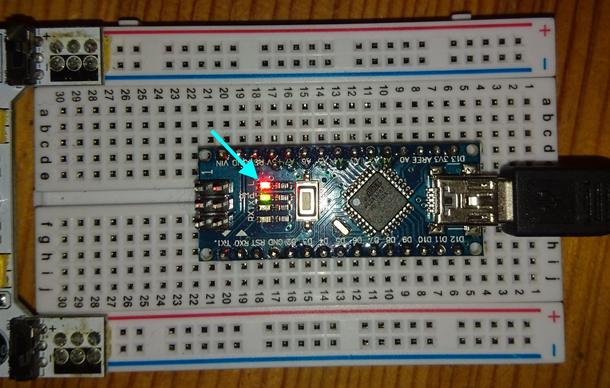

# Arduino Frist Steps

# Voraussetzungen

* Arduino Board (getestet mit Arduino Nano)

* Arduino IDE (V 1.8.2)

* Breadboard / Header-Kabel (macht es leichter, ist aber auch verzichtbar) 

## Simple Blinker

Dieser Sketch lässt die interne LED im Sekundentakt blinken

## Analog Reader

Dieser Sketch liest einfach Messwerte im Wertebereicht von 0-1023 vom analogen Pin 5. 

